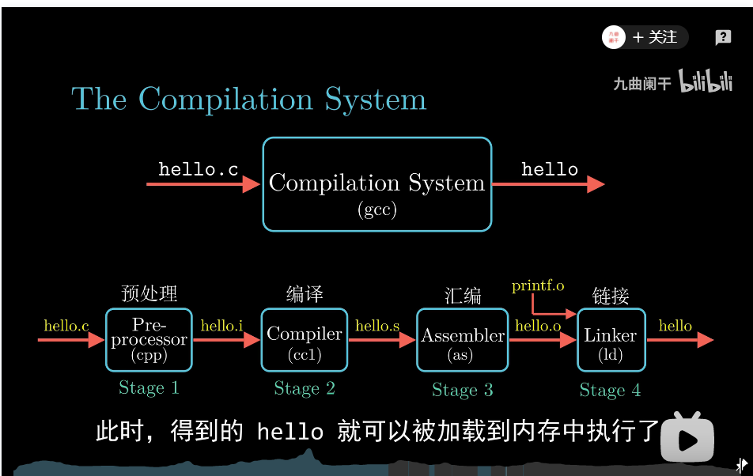
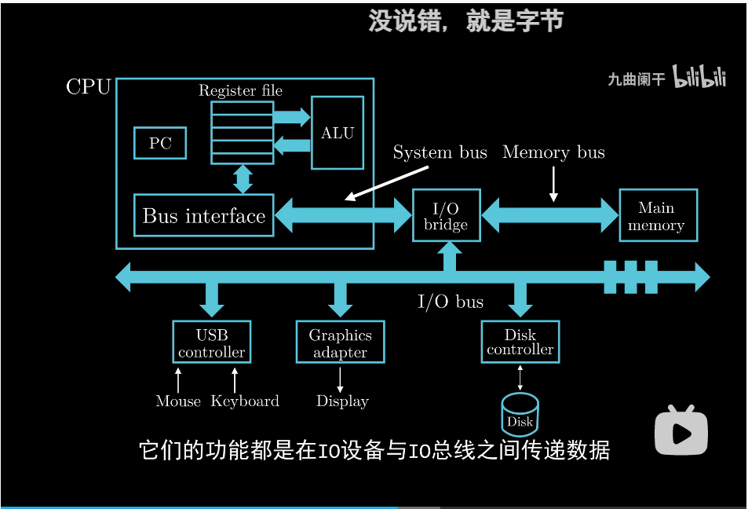
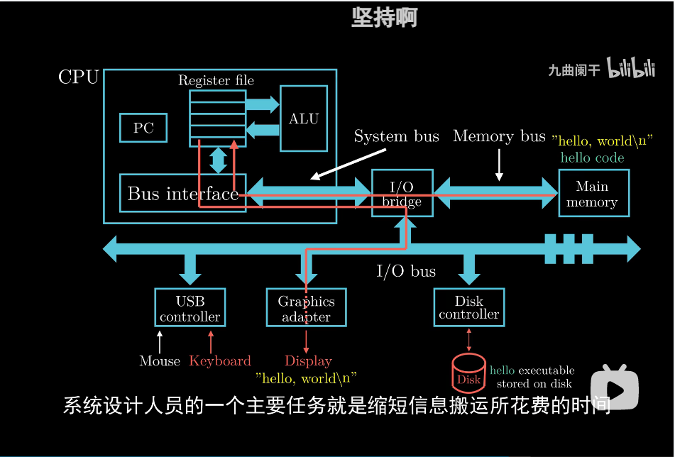

#  计算机系统漫游

## 1 编译系统
- 计算机系统：由硬件和系统软件组成，共同工作来运行应用程序

- `hello.c`程序示例：

```c
#include<stdio.h>

int main(void) {
    printf("hello, world");
    return 0;
}
```



- 编译系统：GCC编译器驱动程序读取源文件`hello.c`，翻译成一个可执行目标文件，执行4个阶段的程序（预处理器、编译器、汇编器和链接器）
  1. 预处理阶段：根据以字符`#`开头的命令，修改原始的C程序
  2. 编译阶段：编译器将文本文件`hello.i`翻译成文本文件`hello.s`
  3. 汇编阶段：汇编器将`hello.s`翻译成机器语言指令，并把这些指令打包成可重定向目标程序`hello.o`
  4. 链接阶段：链接器将标准库中的文件合并到`hello.o`程序中，得到`hello`文件，可以被加载到内存中，由系统执行
- 编译系统的理解：
  1. 优化程序性能
  2. 理解链接过程中出现的错误
  3. 避免安全漏洞

## 2 系统硬件架构图
- 系统的硬件组成
  1. 总线：负责将信息字节在各个部件间传递
  2. I/O设备：系统与外界的联系通道，图中主要有4个设备（键盘、鼠标、显示器和磁盘）
  3. 主存：临时存储设备，用于在处理器执行程序时，存放程序和数据
  4. 处理器：CPU，是执行存储在主存中指令的引擎
- CPU的组成
  1. PC（程序计数器）：用于指向主存中的某条机器语言指令
  2. 寄存器文件：用于临时存放数据
  3. 算术/逻辑单元（ALU）：负责指令的操作



## 3 hello程序的执行流程

1. 通过键盘输入`./hello`，shell程序通过总线将字符串读入寄存器，CPU将字符串`hello`放入内存
2. 通过键盘输入回车，shell程序执行一系列指令，加载可执行文件`hello`
3. 利用DMA技术，不经过CPU，将`hello`的数据和代码直接从磁盘读取到内存中
4. CPU执行`main`函数中的机器语言指令，将`hello, world\\n`，从主存中复制到寄存器文件中，再复制到显示器输出给用户



## 4 高速缓存（Cache）的作用

- 存储容量对比

  |  设备种类  | 存储容量  |
  | :--------: | :-------: |
  | 寄存器文件 | 100~1000B |
  |    内存    |  1~100GB  |
  |    磁盘    | 1~1000TB  |
  
- 高速缓存分类：主要分为三级高速缓存（L1、L2和L3），前两个属于静态随机访问存储器

- 高速缓存与其他存储器的对比：
  1. 速度上：寄存器 > L1 Cache > L2 Cache > L3 Cache > 内存 >  磁盘
  2. 存储上：寄存器 < L1 Cache < L2 Cache < L3 Cache < 内存 <  磁盘
  3. 价格上：寄存器 > L1 Cache > L2 Cache > L3 Cache > 内存 >  磁盘

- 计算机系统组成：
  1. 硬件：处理器、内存、I/O设备
  2. 软件：操作系统、应用程序
  
- 操作系统的基本功能：
  1. 防止硬件被失控的应用程序滥用
  2. 向应用程序提供简单一致的机制，控制这些复杂的底层硬件
  
- 操作系统的抽象：
  1. 文件：对I/O设备的抽象表示
  2. 虚拟内存：对主存和磁盘I/O设备的抽象表示
  3. 进程：对处理器、主存和I/O设备的抽象表示
  
- 上下文：操作系统保持跟踪进程运行所需的所有状态信息，包括PC和寄存器文件的当前值、主存的内容等

- 线程：一个进程由多个线程的执行单元组成，每个线程运行在进程的上下文中，共享同样的代码和全局数据

- 虚拟内存：主要包括程序代码和数据、堆、共享栈、内核虚拟内存

- 文件：所有的I/O设备都可以看成文件，系统中所有的输入和输出都是通过读写文件来完成

- 系统间的交互：通过网络连接，数据流经过网络适配器到达另一台机器

而且寄存器 -> L1 Cache -> L2 Cache -> L3 Cache -> 内存 ->  磁盘 都是层层递进下一层作为上一层储存的预储存

## 5 一些定理(这部分参考锋哥的)

### 5.1 Amdahl定律
&emsp;&emsp;记$\alpha \in [0, 1]$是某任务无法并行处理部分所占的比例，假设任务的工作量是固定的，则对任意$n$个处理器，相比于1个处理器，能够取得的加速比满足：
$$
\displaystyle S(n) < \frac{1}{\alpha}
$$

### 5.2 Gustafson定律
&emsp;&emsp;记$\alpha \in [0, 1]$是某任务无法并行处理部分所占的比例，假设该任务的工作量可以随着处理器个数缩放，从而保持处理时间固定，这对任意$n$个处理器，相比于1个处理器，能够取得的加速比$S(n)$不存在上界

### 5.3 Sun-Ni定律
&emsp;&emsp;记$\alpha \in [0, 1]$是某任务无法并行处理部分所占的比例，假设该任务的可并行部分随着处理器个数$n$按照因子$G(n)$缩放，则对任意个处理器，相比于1个处理器，能够取得的加速比$S(n)$满足：
$$
S(n) = \frac{\alpha + (1 - \alpha) G(n)}{\displaystyle \alpha + (1 - \alpha) \frac{G(n)}{n}}
$$

### 5.4 三个模型加速比分析

|           | 加速比（$n \rightarrow \infty$）                  | 并行效率（$n \rightarrow \infty$） |
| --------- | ------------------------------------------------- | ---------------------------------- |
| Amdahl    | $\displaystyle S(n) \rightarrow \frac{1}{\alpha}$ | $E(n) \rightarrow 0$               |
| Gustafson | $S'(n) \rightarrow \infty$                        | $E'(n) \rightarrow (1 - \alpha)$   |
| Sun-Ni    | $S^*(n) \rightarrow \infty$                       | $E^*(n) \rightarrow 1$             |

### 5.5 并发与并行
1. 线程级并发：在一个进程中执行多个控制流，通过超线程技术，允许一个CPU执行多个控制流
2. 指令级并行：处理器同时执行多条指令，使用流水线处理不同指令的不同部分，达到并行操作的目的
3. 单指令、多数据并行：通过特殊硬件，允许一条指令产生多个可以并行执行的操作，称为SIMD并行，用于提高处理视频、声音这类数据的执行速度

## 6 总结
​	本章主要介绍了计算机系统的组成，内部各个组件相互协同，运行操作系统的应用程序；通过处理器读取并解释存放在主存中的二进制指令，完成指令的运行；操作系统内核是应用程序和硬件之间的媒介，提供三个抽象：文件、虚拟内存、进程，并通过网络使系统之间进行通信。

关于进程与线程

1、进程是资源分配的最小单位，线程是程序执行的最小单位（资源调度的最小单位）
 2、进程有自己的独立地址空间，每启动一个进程，系统就会为它分配地址空间，建立数据表来维护代码段、堆栈段和数据段，这种操作非常昂贵。
 而线程是共享进程中的数据的，使用相同的地址空间，因此CPU切换一个线程的花费远比进程要小很多，同时创建一个线程的开销也比进程要小很多。
 3、线程之间的通信更方便，同一进程下的线程共享全局变量、静态变量等数据，而进程之间的通信需要以通信的方式（IPC)进行。不过如何处理好同步与互斥是编写多线程程序的难点。
 4、但是多进程程序更健壮，多线程程序只要有一个线程死掉，整个进程也死掉了，而一个进程死掉并不会对另外一个进程造成影响，因为进程有自己独立的地址空间。


参考：https://relph1119.github.io/csapp-notes/#/ch01/note