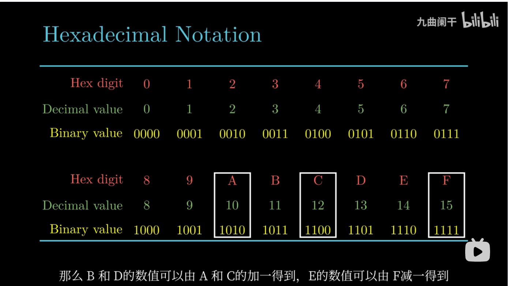

# 信息的储存

## 1.Information Storage(信息存储)

通常情况下，程序将内存视为一个非常大的数组，数组的元素是由一个个的字节组成，每个字节都由一个唯一的数字来表示，我们称为地址（address），这些所有的地址的集合就称为虚拟地址空间（virtual address space）。

**什么是字节？**

**二进制、十进制与十六进制**

**二进制与十六进制的互转**

**十进制2的次方如何快速转16进制**

**十进制与十六进制的转换**

**字长决定了计算机虚拟地址空间的长度**

32位的程序可以运行在32位和64位的机器上

但是64位的程序只能运行在64位的机器上

**大端法与小端法**

0x高有效字节->低有效字节

大端法是最高有效字节储存在最前面

小端法是最低有效字节放在最前面

大多数 Intel 兼容机采用小端模式，IBM 和 Sun 公司的机器大多数机器采用大端法。

对于很多新的处理器，支持双端法，可以配置成大端或者小端运行。

例如基于 ARM架构的处理器，支持双端法，但是 Android 系统和 iOS 系统却只能运行在小端模式《深入理解计算机系统》的原书中，分别在以下 4 种不同的机器进行了程序测试：

1. 运行 linux 系统，字长为 32 位的机器；
2. 运行 windows 系统，字长为 32 为的机器；
3. SUM，大端法的机器；
4. 运行 linux 系统，字长为 64 位的机器.

e.g

12345在不同机器上的运行结果

指针应该是12345所在的内存地址，不同操作系统由于使用不同的存储分配规则，所以指针的值不同。

而不同位数的操作系统字节模式的不同，导致十六进制的值也是不同的

**表示字符串**

字符串通过ASCII码进行表示，字符串结尾以null为标记，对应ASCII码为00

**布尔运算**

## 2.Integer Representations(整数表示)

## 3.Interger Arithmetic(整数运算)

## 4.Floating Point(浮点数)

