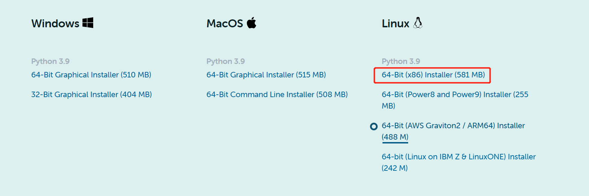
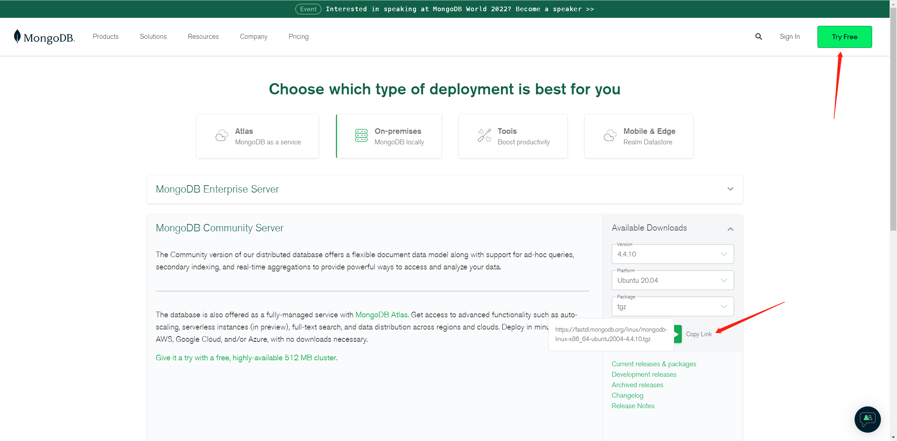
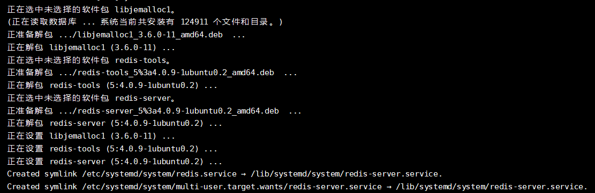
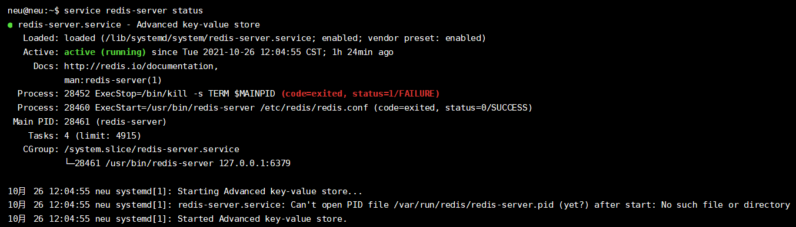
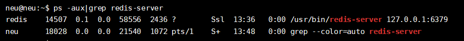

# Config

阿里云服务器：

公网ip:39.108.138.91

欢迎大家访问：http://39.108.138.91:8686

# 0.预备知识

## 0.1关于linux目录架构

我们应该知道 Windows 有一个默认的安装目录专门用来安装软件。[Linux](https://so.csdn.net/so/search?from=pc_blog_highlight&q=Linux) 的软件安装目录也应该是有讲究的，遵循这一点，对后期的管理和维护也是有帮助的。

`/usr` 系统级的目录，可以理解为 `C:/Windows/` ， `/usr/lib` 可理解为 `C:/Windows/System32` 。

`/usr/local` 用户级的程序目录，可以理解为 `C:/Progrem Files/` 。用户自己编译的软件默认会安装到这个目录下。

`/opt` 用户级的程序目录，可以理解为 `D:/Software` ， `opt` 有可选的意思，这里可以用于放置第三方大型软件（或游戏），当你不需要时，直接 `rm -rf` 掉即可。

在硬盘容量不够时，也可将 `/opt` 单独挂载到其他磁盘上使用。

#### 源码放哪里？

`/usr/src` 系统级的源码目录。

`/usr/local/src` 用户级的源码目录。

#### 拓展：

**/opt**

Here’s where optional stuff is put. Trying out the latest Firefox beta? Install it to /opt where you can delete it without affecting other settings. Programs in here usually live inside a single folder whick contains all of their data, libraries, etc.

这里主要存放那些可选的程序。你想尝试最新的firefox测试版吗?那就装到/opt目录下吧，这样，当你尝试完，想删掉firefox的时候，你就可 以直接删除它，而不影响系统其他任何设置。安装到/opt目录下的程序，它所有的数据、库文件等等都是放在同个目录下面。

举个例子：刚才装的测试版firefox，就可以装到/opt/firefox_beta目录下，/opt/firefox_beta目录下面就包含了运 行firefox所需要的所有文件、库、数据等等。要删除firefox的时候，你只需删除/opt/firefox_beta目录即可，非常简单。

**/usr/local**

This is where most manually installed(ie. outside of your package manager) software goes. It has the same structure as /usr. It is a good idea to leave /usr to your package manager and put any custom scripts and things into /usr/local, since nothing important normally lives in /usr/local.

这里主要存放那些手动安装的软件，即不是通过“新立得”或apt-get安装的软件。它和/usr目录具有相类似的目录结构。让软件包管理器来管理/usr目录，而把自定义的脚本(scripts)放到/usr/local目录下面，我想这应该是个不错的主意。

#### 常用目录及用途

`/bin` 存放二进制可执行文件（ls,cat,mkdir等），常用命令一般都在这里。

`/etc` 存放系统管理和配置文件

`/home` 存放所有用户文件的根目录，是用户主目录的基点，比如用户user的主目录就是/home/user，可以用~user表示

`/usr` 用于存放系统应用程序，比较重要的目录/usr/local 本地系统管理员软件安装目录（安装系统级的应用）。这是最庞大的目录，要用到的应用程序和文件几乎都在这个目录。

`/usr/x11r6` 存放x window的目录

`/usr/bin` 众多的应用程序  

`/usr/sbin` 超级用户的一些管理程序  

`/usr/doc` linux文档  

`/usr/include` linux下开发和编译应用程序所需要的头文件  

`/usr/lib` 常用的动态链接库和软件包的配置文件  

`/usr/man` 帮助文档  

`/usr/src` 源代码，linux内核的源代码就放在/usr/src/linux里  

`/usr/local/bin` 本地增加的命令  

`/usr/local/lib` 本地增加的库

`/opt` 额外安装的可选应用程序包所放置的位置。一般情况下，我们可以把tomcat等都安装到这里。

`/proc` 虚拟文件系统目录，是系统内存的映射。可直接访问这个目录来获取系统信息。

`/root` 超级用户（系统管理员）的主目录（特权阶级^o^）

`/sbin` 存放二进制可执行文件，只有root才能访问。这里存放的是系统管理员使用的系统级别的管理命令和程序。如ifconfig等。

`/dev` 用于存放设备文件。

`/mnt` 系统管理员安装临时文件系统的安装点，系统提供这个目录是让用户临时挂载其他的文件系统。

`/boot` 存放用于系统引导时使用的各种文件

`/lib` 存放跟文件系统中的程序运行所需要的共享库及内核模块。共享库又叫动态链接共享库，作用类似windows里的.dll文件，存放了根文件系统程序运行所需的共享文件。

`/tmp` 用于存放各种临时文件，是公用的临时文件存储点。

`/var` 用于存放运行时需要改变数据的文件，也是某些大文件的溢出区，比方说各种服务的日志文件（系统启动日志等。）等。

`/lost+found` 这个目录

# 1.安装anaconda

去官网下载

https://www.anaconda.com/products/individual



拖进/home/admin/software/

bash anacondaxxxx.sh

一路yes

vim ~/.bashrc

最后一行那里

i

export PATH="/root/anaconda3/bin:$PATH"

esc

:wq

source ~/.bashrc


# 2.安装mysql

sudo apt-get update

安装教程是在`Ubuntu20.04`下进行的，安装的MySQL版本为`8.0.27`。 

## 2.1 安装

```bash
sudo apt install mysql-server mysql-client
```

在输入密码后，再输入`yes`即可开始安装。

安装完成后，通过运行命令`mysql -V`查看版本号：

```bash
lyons@ubuntu:~$ mysql -V
mysql  Ver 8.0.27-0ubuntu0.20.04.1 for Linux on x86_64 ((Ubuntu))
```

验证MySQL服务正在运行，命令行下输入：

```bash
sudo service mysql status
```

如果正在运行，则会显示：

```bash
● mysql.service - MySQL Community Server
     Loaded: loaded (/lib/systemd/system/mysql.service; enabled; vendor preset: enabled)
     Active: active (running) since Wed 2021-10-27 10:27:59 CST; 9h ago
   Main PID: 6179 (mysqld)
     Status: "Server is operational"
      Tasks: 39 (limit: 4599)
     Memory: 348.9M
     CGroup: /system.slice/mysql.service
             └─6179 /usr/sbin/mysqld

10月 27 10:27:59 ubuntu systemd[1]: Starting MySQL Community Server...
10月 27 10:27:59 ubuntu systemd[1]: Started MySQL Community Server.
```


## 1.2 配置MySQL的安全性

1. 首先，运行命令`mysql_secure_installation`：

   ```bash
   sudo mysql_secure_installation
   ```

2. `VALIDATE PASSWORD COMPONENT`

   设置验证密码插件。它被用来测试`MySQL`用户的密码强度，并且提高安全性。如果想设置验证密码插件，请输入`y`：

   ```bash
   Connecting to MySQL using a blank password.
   
   VALIDATE PASSWORD COMPONENT can be used to test passwords
   and improve security. It checks the strength of password
   and allows the users to set only those passwords which are
   secure enough. Would you like to setup VALIDATE PASSWORD component?
   
   Press y|Y for Yes, any other key for No: y
   ```

   接下来，将进行密码验证等级设置，根据数字设置对应等级，这里设置为0：

   ```bash
   There are three levels of password validation policy:
   
   LOW    Length >= 8
   MEDIUM Length >= 8, numeric, mixed case, and special characters
   STRONG Length >= 8, numeric, mixed case, special characters and dictionary file
   
   Please enter 0 = LOW, 1 = MEDIUM and 2 = STRONG: 0
   ```

3. **设置密码**

   **为MySQL root用户设置密码，设置过程中密码不会显示。如果设置了验证密码插件，将会显示密码的强度。**

   ```
   Please set the password for root here.
   New password: 
   
   Re-enter new password: 
   
   Estimated strength of the password: 25 
   Do you wish to continue with the password provided?(Press y|Y for Yes, any other key for No) : y
   ```

4. 移除匿名用户

   默认情况下，MySQL安装有一个匿名用户，允许任何人登录MySQL，而不必为他们创建用户帐户。输入`y`进行删除：

   ```
   By default, a MySQL installation has an anonymous user,
   allowing anyone to log into MySQL without having to have
   a user account created for them. This is intended only for
   testing, and to make the installation go a bit smoother.
   You should remove them before moving into a production
   environment.
   
   Remove anonymous users? (Press y|Y for Yes, any other key for No) : y
   Success.
   ```

5. 禁止远程root用户登录

   输入`y`后按`enter`，将会禁止`root`用户登录。

   ```
   Normally, root should only be allowed to connect from
   'localhost'. This ensures that someone cannot guess at
   the root password from the network.
   
   Disallow root login remotely? (Press y|Y for Yes, any other key for No) : y
   Success.
   ```

6. 删除测试库

   输入`y`后按`enter`，将会删除测试库。

   ```
   By default, MySQL comes with a database named 'test' that
   anyone can access. This is also intended only for testing,
   and should be removed before moving into a production
   environment.
   
   
   Remove test database and access to it? (Press y|Y for Yes, any other key for No) : y
    - Dropping test database...
   Success.
   ```

7. 重新加载特权表

   输入`y`后按`enter`，将会重新加载特权表。

   ```
    - Removing privileges on test database...
   Success.
   
   Reloading the privilege tables will ensure that all changes
   made so far will take effect immediately.
   
   Reload privilege tables now? (Press y|Y for Yes, any other key for No) : y
   Success.
   
   All done! 
   ```

   至此，配置完成。


## 1.3 以root用户登录

在MySQL 8.0上，root 用户默认通过`auth_socket`插件授权。`auth_socket`插件通过 Unix socket 文件来验证所有连接到`localhost`的用户。

这意味着你不能通过提供密码，验证为 root。此时，输入`mysql -uroot -p`可能会被拒绝访问：

```bash
lyons@ubuntu:~$ mysql -uroot -p
mysql: [Warning] Using a password on the command line interface can be insecure.
ERROR 1698 (28000): Access denied for user 'root'@'localhost'
```

若要以 root 用户身份登录 MySQL服务器，输入`sudo mysql`，如下：

```bash
# 登录密码为linux系统用户的root密码
admin@ubuntu:~$ sudo mysql
[sudo] admin 的密码： 
Welcome to the MySQL monitor.  Commands end with ; or \g.
Your MySQL connection id is 55
Server version: 8.0.27-0ubuntu0.20.04.1 (Ubuntu)

Copyright (c) 2000, 2021, Oracle and/or its affiliates.

Oracle is a registered trademark of Oracle Corporation and/or its
affiliates. Other names may be trademarks of their respective
owners.

Type 'help;' or '\h' for help. Type '\c' to clear the current input statement.

mysql> 
```

退出MySQL，请输入`exit`命令：

```mysql
mysql> exit
Bye
lyons@ubuntu:~$ 
```

如果你想以 root 身份登录 MySQL 服务器，便于使用其他的程序。可以将验证方法从`auth_socket`修改成`mysql_native_password`。

+ **方式2**（用这个！！）

  推荐的选项，就是创建一个新的独立管理用户，拥有所有数据库的访问权限：

```mysql
# 创建用户
CREATE USER '用户名'@'localhost' identified by '你的密码'

# 赋予admin用户全部的权限，你也可以只授予部分权限
GRANT ALL PRIVILEGES ON *.* TO '用户名'@'localhost';
```

​		示例：

```mysql
# 创建名为admin的用户，密码为mysql123
mysql> create user 'admin'@'localhost' identified by 'mysql123';
Query OK, 0 rows affected (0.01 sec)

# 将访问所有database以及表的权利授权用户admin
#with gran option表示该用户可给其它用户赋予权限，但不可能超过该用户已有的权限
mysql> grant all privileges on *.* to 'admin'@'localhost' with grant option;
Query OK, 0 rows affected (0.00 sec)

mysql> FLUSH PRIVILEGES;
Query OK, 0 rows affected (0.00 sec)

# 查看已有的用户
mysql> select user, host from mysql.user;
+------------------+-----------+
| user             | host      |
+------------------+-----------+
| admin            | localhost |
| debian-sys-maint | localhost |
| mysql.infoschema | localhost |
| mysql.session    | localhost |
| mysql.sys        | localhost |
| root             | localhost |
+------------------+-----------+
6 rows in set (0.00 sec)

# 退出root用户登录
mysql> exit
Bye

# 登录admin用户，输入密码mysql123即可登录成功
lyons@ubuntu:~$ mysql -uadmin -p
Enter password: 
Welcome to the MySQL monitor.  Commands end with ; or \g.
Your MySQL connection id is 16
Server version: 8.0.27-0ubuntu0.20.04.1 (Ubuntu)

Copyright (c) 2000, 2021, Oracle and/or its affiliates.

Oracle is a registered trademark of Oracle Corporation and/or its
affiliates. Other names may be trademarks of their respective
owners.

Type 'help;' or '\h' for help. Type '\c' to clear the current input statement.

mysql> 
```

说明：`'admin'@'localhost'`中，`localhost`指本地才可连接，可以将其换成`%`指任意`ip`都能连接，也可以指定`ip`连接。


# 3.mongodb安装

## 3.1安装mongodb

```bash
# 安装依赖包
sudo apt-get install libcurl4 openssl
# 关闭和卸载原有的mongodb
service mongodb stop
sudo apt-get remove mongodb
```



这里我们选择 tgz 下载，下载完安装包，并解压 **tgz**（以下演示的是 64 位 Linux上的安装） 。

```bash
#统一下载文件
cd /home/admin/software

#下载
wget https://fastdl.mongodb.org/linux/mongodb-linux-x86_64-ubuntu2004-4.4.10.tgz 

#解压到/usr/local这个目录下
tar -zxvf mongodb-linux-x86_64-ubuntu2004-4.4.10.tgz --directory /usr/local
```

改一下mongodb-linux-x86_64-ubuntu2004-4.4.10这个文件的名字为mongodb

MongoDB 的可执行文件位于 bin 目录下，所以可以将其添加到 **PATH** 路径中

```
export PATH="/usr/local/mongodb/bin:$PATH"
```

**<mongodb-install-directory>**为你 MongoDB 的安装路径。

esc

:wq

```bash
source ~/.bashrc
```


## 3.2创建数据库目录

默认情况下 MongoDB 启动后会初始化以下两个目录：

- 数据存储目录：/var/lib/mongodb
- 日志文件目录：/var/log/mongodb

我们在启动前可以先创建这两个目录：

```bash
sudo mkdir -p /var/lib/mongo
sudo mkdir -p /var/log/mongodb
```

接下来启动 Mongodb 服务：

```bash
mongod --dbpath /var/lib/mongo --logpath /var/log/mongodb/mongod.log --fork
mongo
```


# 4.redis安装

本项目是基于Ubuntu环境进行开发，因此接下来都以Ubuntu的环境为基础，对于其他开发环境，大家可以参考相关的[资料](https://www.redis.com.cn/redis-installation.html)进行学习。

**安装Redis服务器：**

```shell
sudo apt-get install redis-server
```

下载完成的结果



**启动Redis服务：**

一般来说，当安装完成后，Redis服务器会自动启动，可以通过以下命令检查是否启动成功。（ps：如果Active显示为 active(running) 状态：表示redis已在运行，启动成功）

```shell
service redis-server status
```



检查当前进程，查看redis是否启动。（ps: 可以看到redis服务正在监听6379端口）

```shell
ps -aux|grep redis-server
```



或者进入redis客户端，与服务器进行通信，当输入ping命令，如果返回 PONG 表示Redis已成功安装。

```shell
redis-cli 
```


上面的127.0.0.1 是redis服务器的 IP 地址，6379 是 Redis 服务器运行的端口。


# 5.node安装

https://blog.csdn.net/Xiaofeng7s/article/details/106610968

参考了这篇在/opt下装的，但是参考yly的教程让安在/usr/local/下

先下载node-v8.17.0-linux-x64.tar放在/opt下面

```bash
tar -xvf node-v8.17.0-linux-x64.tar

#环境变量配置
vim ~/.bashrc
-----
👇最后一行（i）
export PATH="/opt/node-v8.17.0-linux-x64/bin:$PATH"
-----esc :wq

#check success
node -v
npm -v
```


# 6.源码导入

看了下readme

源码是放在\home下面新建了\fun-rec下的，参照这个机构上传

注意

fun-rec-master\codes\news_recsys\news_rec_web\Vue-newsinfo\src\api

里面有个乱码的api文档，我把它删了才能顺利ftp穿上阿里云


# 7.前端环境

## 7.1前端环境安装

\home\fun-rec\codes\news_recsys\news_rec_web\Vue-newsinfo

首先要装py2

```bash
apt install python2
```

然后换cnpm

```bash
npm install -g cnpm --registry=https://registry.npm.taobao.org cnpm install
cnpm install
```

然后删掉modules

```bash
npm install rimraf -g 
rimraf node_modules
```

然后root用户的话

```bash
npm install --production --unsafe-perm=true --allow-root
```

非root用户

```bash
sudo npm install
```

## 7.2前端配置文件修改

\home\fun-rec\codes\news_recsys\news_rec_web\Vue-newsinfo\src\main.js

```javascript
//修改成公网ip,3000是api接口的端口
Vue.use(VueAxios, axios);
// axios公共基路径，以后所有的请求都会在前面加上这个路径
axios.defaults.baseURL = "http://39.108.138.91:3000";
```


# 8.后端环境

## python环境的安装

在安装完Anaconda之后，创建一个新闻推荐的虚拟环境，我这边将其命名为news_rec_py3，**这个环境将会在整个新闻推荐项目中使用。**

```C++
conda create -n news_rec_py3 python==3.8
```

## Scrapy的简介与安装

Ubuntu下安装Scrapy，需要先安装依赖Linux依赖

```bash
sudo apt-get install python3 python3-dev python3-pip libxml2-dev libxslt1-dev zlib1g-dev libffi-dev libssl-dev
```


## python3依赖安装

激活虚拟环境，安装依赖

```
conda activate news_rec_py3

#切换目录
cd /home/fun-rec/codes/news_rec_server/
pip install -r requirements.txt
```

安装pysnowflake

```
pip install pysnowflake
```


## 后端配置文件修改

\home\fun-rec\codes\news_recsys\news_rec_server\conf

dao_config.py

```python
# 修改mysql账号密码
mysql_username = "xxxxx"
mysql_passwd = "xxxxxxxxx"
mysql_hostname = "localhost"
mysql_port = "3306"
```

proj_path.py

```python
#修改home_path
#home_path = os.environ['home']
home_path = "/home/"
proj_path = home_path + "/fun-rec/codes/news_recsys/news_rec_server/"
```


\home\fun-rec\codes\news_recsys\news_rec_server\dao

mysql_server.py

```python
# 修改mysql账号密码
class MysqlServer(object):
    def __init__(self, username="xxxxx", passwd="xxxxxxx", hostname="localhost", port="3306",
        user_info_db_name=user_info_db_name, loginfo_db_name=loginfo_db_name):

        self.username = username
        self.passwd = passwd
        self.hostname = hostname
        self.port = port
        self.user_info_db_name = user_info_db_name
        self.loginfo_db_name = loginfo_db_name
```


# 9.前后端环境启动

顺序是后端环境、pysnowflake、前端环境

开三个terminal

如果没开news_rec_py3的虚拟环境，就是命令行前面没有(news_rec_py3)，前两个terminal要先输

```bash
conda activate news_rec_py3
```


## 9.1后端环境启动

先去mysql里面

```
mysql -uroot -p
```

```
create database userinfo;
```


\home\fun-rec\codes\news_recsys\news_rec_server

```bash
python server.py
```


## 9.2snowflake服务启动

```bash
snowflake_start_server --address=127.0.0.1 --port=8910 --dc=1 --worker=1
```


## 9.3前端环境启动

\home\fun-rec\codes\news_recsys\news_rec_web\Vue-newsinfo

```bash
npm run dev
```

这次遇到过报错

sh: 1: webpack-dev-server: not found

cnpm install一下之后再npm run dev就好了


## 9.4服务器防火墙设置

把8686、3000端口开了


## 9.5访问

接下来访问http://服务器公网ip:8686应该就能到首页了


# 10.Scrapy爬虫设置


## 10.1手动爬取新浪新闻

\home\fun-rec\codes\news_recsys\news_rec_server\materials\news_scrapy\sinanews

settings.py

```python
from typing import Collection
import sys 
#这个sys.path有问题要改一下
sys.path.append("/home/fun-rec/codes/news_recsys/news_rec_server")
from conf.dao_config import mongo_hostname, mongo_port, sina_db_name, sina_collection_name_prefix
```

terminal，记得激活环境

```bash
#暂时先爬30页
python run.py --page=30
```


## 10.2更新物料画像

\home\fun-rec\codes\news_recsys\news_rec_server\materials\process_material.py

```bash
python process_material.py
```


## 10.3更新用户画像

\home\fun-rec\codes\news_recsys\news_rec_server\materials\process_user.py

```
python process_user.py
```


## 10.4清除前一天redis中的数据，更新最新今天最新的数据

\home\fun-rec\codes\news_recsys\news_rec_server\materials\update_redis.py

```
python update_redis.py
```


## 10.5离线将推荐列表和热门列表存入redis

\home\fun-rec\codes\news_recsys\news_rec_server\recprocess\offline.py

```
python offline.py
```


## 10.6重新登录用户查看新闻

终于踩坑结束


