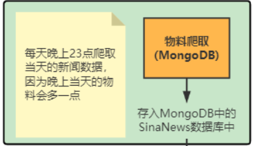
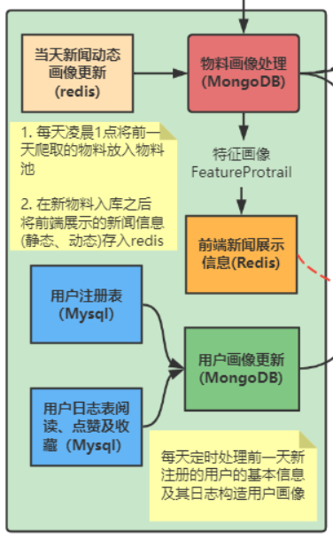

# 离线物料系统的构建

这块主要包含两部分，一部分是Scrapy爬取新浪新闻，一部分是自动化构建用户及物料画像。

# 1Scrapy爬取新浪新闻



这里暂时先空着

# 2自动化构建用户及物料画像



由于新闻是通过爬虫获取的，所以还需要对爬取的新闻数据进行处理，也就是构造新闻的画像。对于用户侧的画像则是需要每天将新注册的用户添加到用户画像库中，对于在系统中产生了行为的用户，我们还需要定期的更新用户的画像（长短期）。下面分别从物料侧和用户侧两个方面来详细解释这两类画像在系统中是如何自动化构建的。


MongoDB结构梳理：

mongoDB里面有两个database，一个是SinaNews，一个是NewsRecSys

SinaNews是存爬虫的数据

NewsRecSys是构建画像的，它包含3个collection

其中FeatureProtrail、RedisProtrail是新闻画像库

FeatureProtrail画像库存储了物料的所有字段。

RedisProtrail存储前端展示内容, 这个画像库中的物料是一样的多，只不过每个物料存储的内容不一样，这个特征库的内容每天都会被更新，作为存储再redis中的新闻内容的备份内容。

UserProtrail是用户画像库

## 2.1物料侧画像的构建

### 2.1.1物料画像更新步骤

- 将每天爬虫的新闻（MongoDB的`SinaNews`库的`news_date`）并**去重**添加到物料特征库（MongoDB的`NewsRecSys`库的`FeatureProtrail`集合）中
- 将用户的行为记录（阅读、点赞和收藏）（新闻动态画像redis的`dynamic_news_details`）更新到物料特征库`FeatureProtrail`
- 将所有的物料特征库`FeatureProtrail`数据复制到`RedisPortrail`集合中作为备份，用于给前端展示


### 2.1.2物料画像代码

代码位于`materials/material_process/news_protrait.py`

这部分顺着这个代码看就行了，我已经把main函数抽出来，然后一个个解释里面的类内函数了，其中下划线开头的是类内函数

```python
#以下是main()函数
from material_process.utils import get_key_words
from dao.mongo_server import MongoServer
from dao.redis_server import RedisServer
class NewsProtraitServer:
    def __init__(self):
        """
        初始化相关参数
        """
        #实例化mongoServer()
        self.mongo_server = MongoServer()
        #返回mongoDB中SinaNews.news_date 当天的新浪新闻的collection
        self.sina_collection = self.mongo_server.get_sina_news_collection()
        #返回mongoDB中NewsRecSys.FeatureProtrail
        self.material_collection = self.mongo_server.get_feature_protrail_collection()
        #返回mongoDB中NewsRecSys.RedisPortrail
        self.redis_mongo_collection = self.mongo_server.get_redis_mongo_collection()
        #返回Redis中db2-dynamic_news_details,也就是新闻的阅读量、喜欢、收藏
        self.news_dynamic_feature_redis = RedisServer().get_dynamic_news_info_redis()

# 1.实例化
news_protrait = NewsProtraitServer()
# 2.新物料画像的更新
news_protrait.update_new_items()
------------------------------------------------------------------------
Mongo.SinaNews.news_date -> Mongo.NewsRecSys.FeatureProtrail

    def update_new_items(self):
        """
        将今天爬取的数据构造画像存入画像数据库中
        """
        # 遍历今天爬取的所有数据
        for item in self.sina_collection.find():
            # 根据标题进行去重
        !->if self._find_by_title(self.material_collection, item["title"]):
                continue
       !!->news_item = self._generate_feature_protrail_item(item)
            # 插入物料池
            self.material_collection.insert_one(news_item)
        
        print("run update_new_items success.")

    #!->29行用到_find_by_title()函数,根据爬虫数据的title去找FeatureProtrail里面有没有这个title的新闻了
    def _find_by_title(self, collection, title):
        """从数据库中查找是否有相同标题的新闻数据
        数据库存在当前标题的数据返回True, 反之返回Flase
        """
        # find方法，返回的是一个迭代器
        find_res = collection.find({"title": title})
        if len(list(find_res)) != 0:
            return True
        return False
    
    #!!->31行用到_generate_feature_protrail_item()函数，如果FeatureProtrail里面没有，就创建这个dict(键值对)
    def _generate_feature_protrail_item(self, item):
        """生成特征画像数据，返回一个新的字典
        """
        news_item = dict()
        news_item['news_id'] = item['news_id']
        news_item['title'] = item['title']
        # 从新闻内容中提取的关键词没有原始新闻爬取时的关键词准确，所以手动提取的关键词
        # 只是作为一个补充，当原始新闻中没有提供关键词的时候可以使用
        news_item['raw_key_words'] = item['raw_key_words']
        key_words_list = get_key_words(item['content'])
        news_item['manual_key_words'] = ",".join(key_words_list)
        news_item['ctime'] = item['ctime']
        news_item['content'] = item['content']
        news_item['cate'] = item['cate']
        news_item['url'] = item['url']
        news_item['likes'] = 0
        news_item['collections'] = 0
        news_item['read_num'] = 0
        news_item['hot_value'] = 1000 # 初始化一个比较大的热度值，会随着时间进行衰减
        
        return news_item
------------------------------------------------------------------------
# 3.更新动态特征
news_protrait.update_dynamic_feature_protrail()
------------------------------------------------------------------------
redis.db2-dynamic_news_details -> mongodb.FeatureProtrail

    def update_dynamic_feature_protrail(self):
        """
        用redis的动态画像更新mongodb的画像
        """
        # 遍历redis的db2-dynamic_news_details，对应更新mongodb.FeatureProtrail中的新闻的阅读量、喜欢、收藏 
        news_list = self.news_dynamic_feature_redis.keys()
        for news_key in news_list:
            #给一个news_key的样本->
            #dynamic_news_detail:000b283a-3da6-41ee-aec6-a8fb37c01687
            #给一个news_dynamic_info_str的样本->
            #{'likes': 0, 'collections': 0, 'read_num': 0}
            news_dynamic_info_str = self.news_dynamic_feature_redis.get(news_key)
            # 将单引号都替换成双引号
            news_dynamic_info_str = news_dynamic_info_str.replace("'", '"' ) 
            news_dynamic_info_dict = json.loads(news_dynamic_info_str)
            #这里其实不太理解，是不是json.loads的话key一定要用双引号包住
            
            # 查询mongodb中对应的数据，并将对应的画像进行修改
            news_id = news_key.split(":")[1]
            #按news_id把FeatureProtrail中的这条新闻抽出来
            mongo_info = self.material_collection.find_one({"news_id": news_id})
            #copy一份新的出来
            new_mongo_info = mongo_info.copy()
            #把news_dynamic_info_dict赋值进去
            new_mongo_info['likes'] = news_dynamic_info_dict["likes"]
            new_mongo_info['collections'] = news_dynamic_info_dict["collections"]
            new_mongo_info['read_num'] = news_dynamic_info_dict["read_num"]
			# 按mongo_info为filter去FeatureProtrail中找出来并替换，replace_one的参数upsert为True的话，如果没有这些键值的话就直接插入
            self.material_collection.replace_one(mongo_info, new_mongo_info, upsert=True) 
        print("update_dynamic_feature_protrail success.")
------------------------------------------------------------------------
# 4.清掉RedisPortrail，根据FeatureProtrail重新写入
news_protrait.update_redis_mongo_protrail_data()
------------------------------------------------------------------------
Mongo.FeatureProtrail -> Mongo.RedisPortrail

    def update_redis_mongo_protrail_data(self):
        """每天都需要将新闻详情更新到redis中，并且将前一天的redis数据删掉
        """
        # 清掉RedisPortrail，然后再重新写入
        self.redis_mongo_collection.drop()
        print("delete RedisProtrail ...")
        # 遍历特征库
        for item in self.material_collection.find():
            news_item = dict()
            news_item['news_id'] = item['news_id']
            news_item['title'] = item['title']
            news_item['ctime'] = item['ctime']
            news_item['content'] = item['content']
            news_item['cate'] = item['cate']
            news_item['url'] = item['url']
            news_item['likes'] = item['likes']
            news_item['collections'] = item['collections']
            news_item['read_num'] = item['read_num']

            self.redis_mongo_collection.insert_one(news_item)
        print("run update_redis_mongo_protrail_data success.")
------------------------------------------------------------------------
```


### 2.1.3更新物料到redis中

- 使用方法：`news_detail_to_redis()`方法，代码位于`materials/material_process/news_to_redis.py`
- 具体代码逻辑：删除所有Redis中的内容，将新闻静态数据（`news_id`、`title`、`ctime`、`content`、`cate`、`url`）存入Redis[1]中，将新闻动态画像（`likes`、`collections`、`read_num`）存入Redis[2]中，具体格式如下：

```python
# 当天新闻静态数据（static_news_detail:新闻ID :{新闻ID、标题、发布时间、新闻内容、类别、URL链接}）
static_news_info_db_num = 1
# 动态新闻画像（dynamic_news_detail:新闻ID :{用户行为：阅读、点赞、收藏}）
dynamic_news_info_db_num = 2
```

```python
#main()函数内容👇
from dao.mongo_server import MongoServer
from dao.redis_server import RedisServer
#初始化
class NewsRedisServer(object):
    def __init__(self):
        #返回redis.db0-用户推荐列表redis数据库
        self.rec_list_redis = RedisServer().get_reclist_redis()
        #返回redis.db1-获取静态新闻信息数据库
        self.static_news_info_redis = RedisServer().get_static_news_info_redis()
        #返回redis.db2-获取动态新闻信息数据库
        self.dynamic_news_info_redis = RedisServer().get_dynamic_news_info_redis()
        #返回mongo.RedisPortrail-mongo中的FeatureProtrail备份数据集合
        self.redis_mongo_collection = MongoServer().get_redis_mongo_collection()
        # 删除前一天redis中的内容
        self._flush_redis_db()
        

# 1.每次创建这个对象的时候都会把数据库中之前的内容删除，因为初始化执行了_flush_redis_db()
news_redis_server = NewsRedisServer()
------------------------------------------------------------------------
    def _flush_redis_db(self):
        """
        每天都需要删除redis中的内容，更新当天新的内容上去
        """
        try:
            self.rec_list_redis.flushall()
        except Exception:
            print("flush redis fail ... ")
------------------------------------------------------------------------

# 2.将最新的RedisPortrail传到redis
news_redis_server.news_detail_to_redis()
------------------------------------------------------------------------

    def news_detail_to_redis(self):
        """
        将需要展示的画像内容存储到redis
        静态不变的特征存到static_news_info_db_num
        动态会发生改变的特征存到dynamic_news_info_db_num
        """ 
        news_id_list = self._get_news_id_list()
		++++++++++++++++++++++++++++++++++++++++++++++++++++++++++++++
        mongo.RedisPortrail -> news_id_list
        def _get_news_id_list(self):
            """
            获取所有数据的news_id
            暴力获取，直接遍历整个mongo.RedisPortrail，得到所有新闻的id
            TODO 应该存在优化方法可以通过查询的方式只返回new_id字段
            """
            news_id_list = []
            for item in self.redis_mongo_collection.find():
                news_id_list.append(item["news_id"])
            return news_id_list
        ++++++++++++++++++++++++++++++++++++++++++++++++++++++++++++++
        for news_id in news_id_list:
            # 返回的是一个列表里面套了一个字典(mongo.RedisPortrail)
            news_item_dict = self.redis_mongo_collection.find_one({"news_id": news_id})   
            #pop()方法删除字典给定键 key 及对应的值，因为find_one返回会带上_id这个键值{'_id': ObjectId('5b23696ac315325f269f28d1'), 'name': 'RUNOOB', ...}
            news_item_dict.pop("_id")

            # 分离动态属性和静态属性
            static_news_info_dict = dict()
            static_news_info_dict['news_id'] = news_item_dict['news_id']
            static_news_info_dict['title'] = news_item_dict['title']
            static_news_info_dict['ctime'] = news_item_dict['ctime']
            static_news_info_dict['content'] = news_item_dict['content']
            static_news_info_dict['cate'] = news_item_dict['cate']
            static_news_info_dict['url'] = news_item_dict['url']
            #语法糖 等于是static_content_tuple = ("static_news_detail:" + str(news_id), str(static_news_info_dict))
            static_content_tuple = "static_news_detail:" + str(news_id), str(static_news_info_dict)
            #self.static_news_info_redis = RedisServer().get_static_news_info_redis()
            self._set_info_to_redis(self.static_news_info_redis, static_content_tuple)
			++++++++++++++++++++++++++++++++++++++++++++++++++++++++++
            #添加静态属性
            static_content_tuple -> redis.db1-static_news_details
                def _set_info_to_redis(self, redisdb, content):
                    """
                    将content添加到指定redis.db
                    """
                    try: 
                        redisdb.set(*content)
                    except Exception:
                        print("set content fail".format(content))
            ++++++++++++++++++++++++++++++++++++++++++++++++++++++++++
            dynamic_news_info_dict = dict()
            dynamic_news_info_dict['likes'] = news_item_dict['likes']
            dynamic_news_info_dict['collections'] = news_item_dict['collections']
            dynamic_news_info_dict['read_num'] = news_item_dict['read_num']
            dynamic_content_tuple = "dynamic_news_detail:" + str(news_id), str(dynamic_news_info_dict)
            self._set_info_to_redis(self.dynamic_news_info_redis, dynamic_content_tuple)
			++++++++++++++++++++++++++++++++++++++++++++++++++++++++++
             #和上面的同理，添加动态属性
            dynamic_content_tuple -> redis.db2-dynamic_news_details
            ++++++++++++++++++++++++++++++++++++++++++++++++++++++++++

        print("news detail info are saved in redis db.")
------------------------------------------------------------------------
```

**到此位置，离线物料画像的更新逻辑就介绍完了，最后把上面的逻辑用代码全部串起来的话就如下代码：**下面的代码是会在每天定时运行的，这样就将物料侧的画像构建逻辑穿起来了

```python
from material_process.news_protrait import NewsProtraitServer
from material_process.news_to_redis import NewsRedisServer

def process_material():
    """物料处理函数
    """
    # 画像处理
    protrail_server = NewsProtraitServer()
    # 处理最新爬取新闻的画像，存入特征库
    protrail_server.update_new_items()
    # 更新新闻动态画像, 需要在redis数据库内容清空之前执行
    protrail_server.update_dynamic_feature_protrail()
    # 生成前端展示的新闻画像，并在mongodb中备份一份
    protrail_server.update_redis_mongo_protrail_data()

    # 新闻数据写入redis, 注意这里处理redis数据的时候是会将前一天的数据全部清空
    news_redis_server = NewsRedisServer()
    # 将最新的前端展示的画像传到redis
    news_redis_server.news_detail_to_redis()


if __name__ == "__main__":
    process_material() 
```


## 2.2用户画像构建

### 2.2.1数据结构

对于用户画像的更新来说主要分为两方面：

1. 新注册用户画像的更新
2. 老用户画像的更新

由于我们系统中将所有注册过的用户都放到了一个表里面（新、老用户），所以每次更新画像的话只需要遍历一遍注册表中的所有用户。再说具体的画像构建逻辑之前，得先了解一下用户画像中包含哪些字段，下面是直接从mongo中查出来的

```bash
> db.UserProtrail.find().limit(1).pretty()
{
        "_id" : ObjectId("61b8548599d38b7fc33c2ce5"),
        "userid" : NumberLong("4568721114285477889"),
        "username" : "sean",
        "passwd" : "sean123456",
        "gender" : "male",
        "age" : "22",
        "city" : "BeiJing",
        "like_15_intr_cate" : "国内,体育,社会",
        "like_15_intr_key_words" : "装置,磁悬浮,移植",
        "like_15_avg_hot_value" : 1.868465930154964,
        "like_15_news_num" : 3,
        "collection_15_intr_cate" : "国内,体育",
        "collection_15_intr_key_words" : "装置,磁悬浮,移植,皇马,比赛,禁区,检测,感染者,疫情",
        "collection_15_avg_hot_value" : 1.1202302695554085,
        "collection_15_news_num" : 3
}
```

从上面可以看出，主要是用户的基本信息和用户历史信息相关的一些标签

对于用户的基本属性特征这个可以直接从注册表中获取：

MySQL ->

userinfo.register_user

对于跟用户历史阅读相关的信息，需要统计用户历史的所有阅读、喜欢和收藏的新闻详细信息,为了得到跟用户历史兴趣相关的信息，我们需要对用户的历史阅读、喜欢和收藏这几个历史记录给存起来

MySQL ->

userinfo.user_collections

userinfo.user_likes

userinfo.user_read

### 2.2.2用户画像更新的业务逻辑

- 将用户的新闻曝光数据保存到MySQL中，用于进行去重
- 更新用户画像，主要更新用户的静态信息和动态信息（阅读、点赞、收藏等相关指标数据），存储到MongoDB中

### 2.2.3核心函数的代码逻辑

- `user_exposure_to_mysql()`方法（代码位于`materials/user_process/user_to_mysql.py`）：将用户的新闻曝光数据从Redis（用户ID：{<list>(新闻ID: 曝光时刻)}）存入到MySQL中`exposure_<current_date>`表中

  ```python
  from dao.redis_server import RedisServer
  from dao.mysql_server import MysqlServer
  from dao.entity.user_exposure import UserExposure
  #初始化
  class UserMysqlServer(object):
      def __init__(self):
          #返回redis.db3-user_exposure 用户曝光列表redis数据库
          self.user_exposure_redis = RedisServer().get_exposure_redis()
          #返回一个连接userinfo数据库的session
          self.user_exposure_sql_session = MysqlServer().get_user_exposure_session()
  
  #main()函数
  if __name__ == "__main__":
      user_mysql_server = UserMysqlServer()
  
      user_mysql_server.user_exposure_to_mysql()
      --------------------------------------------------------------
      def user_exposure_to_mysql(self):
          # 为了通过__init__()函数构建表
          # 其实不太理解UserExposure()这个函数，需要去了解一下sqlalchemy，这里大概就是建表的意思
          exposure = UserExposure()   
          vals = []
          keys = self.user_exposure_redis.keys()
          #这个keys大概是这样的
          #(user_exposure:4568721114285477889
          #,user_exposure:4569404916662013953
          #,...)
          for key in keys:
              #返回redis.db3-user_exposure，smembers好像是查看collection中这个key的所有成员
              news_list = self.user_exposure_redis.smembers(key)
              #这个news_list大概是这样的
              #row	value
              #1	fe9f7a59-5287-460c-a361-d12b368fb9e0:1639712648453
              #2	f41b0394-cbc3-41c7-9911-17a8229048e9:1639712651902
              #...
              #n	news_id:时间戳
              #分割一下取后面那部分
              user_id = key.split(":")[1]  
              val = self._transfor_json_for_user(user_id,news_list)
              +++++++++++++++++++++++++++++++++++++++++++++++++++++
                  def _transfor_json_for_user(self,user_id,news_list):
                      """
                      针对每个用户转换成批量存储的形式
                      """
                      # 对用户的每一个曝光进行存储
                      vals = []
                      for item in news_list:
                          item = item.split(":")
                          vals.append({
                              "userid":user_id,
                              "newid":item[0],
                              "curtime":item[1]})
                      return vals
                  #vals 
                  #[{"user_id":xxxx,"newid":xxxx,"curtime":xxx},{"user_id":yyyy,"newid":yyyy,"curtime":yyy},{"user_id":zzzz,"newid":zzzz,"curtime":zzz}]
      		+++++++++++++++++++++++++++++++++++++++++++++++++++++
              vals += val
              #接一串字典
              
  		#调用连接userinfo数据库的session，然后bulk_insert_mappings()这个应该是插入数据吧
     		self.user_exposure_sql_session.bulk_insert_mappings(UserExposure,vals)
          #提交这个session
      	self.user_exposure_sql_session.commit()
      --------------------------------------------------------------
  ```

  

- `update_user_protrail_from_register_table()`方法（代码位于`materials/user_process/user_protrail.py`）：将当天新用户（注册用户）和老用户的静态信息和动态信息（阅读、点赞、收藏等相关指标数据）都添加到用户画像库中（MongoDB的`NewsRecSys`库的`UserProtrail`集合）

  ```python
  from dao.mongo_server import MongoServer
  from dao.mysql_server import MysqlServer
  from dao.entity.register_user import RegisterUser
  from dao.entity.user_read import UserRead
  from dao.entity.user_likes import UserLikes
  from dao.entity.user_collections import UserCollections
  
  #初始化
  class UserProtrail(object):
      def __init__(self):
          self.user_protrail_collection = MongoServer().get_user_protrail_collection()
          self.material_collection = MongoServer().get_feature_protrail_collection()
          self.register_user_sess = MysqlServer().get_register_user_session()
          self.user_collection_sess = MysqlServer().get_user_collection_session()
          self.user_like_sess = MysqlServer().get_user_like_session()
          self.user_read_sess = MysqlServer().get_user_read_session()
          
          
  if __name__ == "__main__":
      user_protrail = UserProtrail().update_user_protrail_from_register_table()
  	—————————————————————————————————————————————————————————————————————————
      def update_user_protrail_from_register_table(self):
          """每天都需要将当天注册的用户添加到用户画像池中
          """
          # 遍历注册用户表
          #self.register_user_sess = MysqlServer().get_register_user_session()
          for user in self.register_user_sess.query(RegisterUser).all():
              #将mysql查询出来的结果转换成字典存储
              user_info_dict = self._user_info_to_dict(user)
              #self.user_protrail_collection = MongoServer().get_user_protrail_collection()
              old_user_protrail_dict = self.user_protrail_collection.find_one({"username": user.username})
              if old_user_protrail_dict is None:
                  self.user_protrail_collection.insert_one(user_info_dict)
              else:
                  # 使用参数upsert设置为true对于没有的会创建一个
                  # replace_one 如果遇到相同的_id 就会更新
                  self.user_protrail_collection.replace_one(old_user_protrail_dict, user_info_dict, upsert=True)
  ```

  

- `_user_info_to_dict()`方法（代码位于`materials/user_process/user_protrail.py`）：将用户基本属性和用户的动态信息进行组合，对于已存在的指标数据（分为爱好和收藏，每个分类都包括历史喜欢最多的Top3的新闻类别、历史喜欢新闻的Top3的关键词、用户喜欢新闻的平均热度、用户15天内喜欢的新闻数量）进行更新，对于未存在的指标数据进行初始化